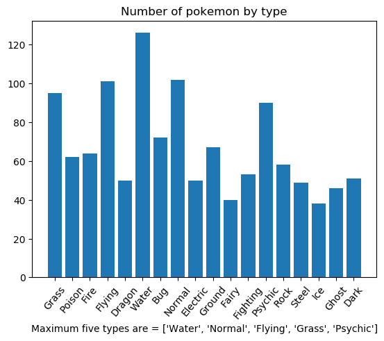
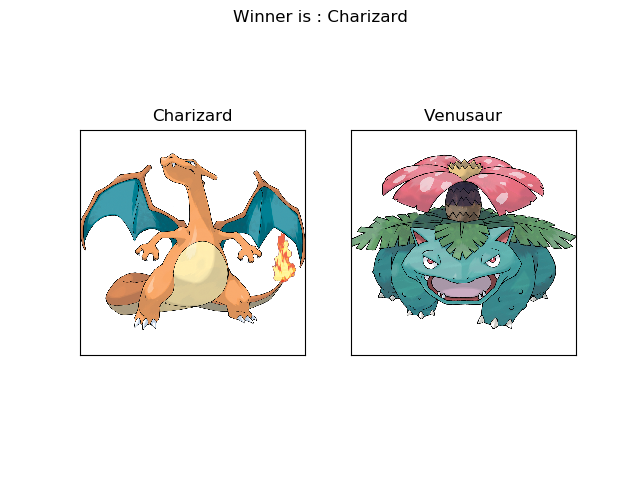

# POKEMON MAESTER
An application for predicting the likeliest winner between two pokemon. Can be used to settle which pokemon should be used in a battle.  

# Data
The data used for this project was collection from <a href = 'https://www.kaggle.com/terminus7/pokemon-challenge'> here. </a>  
From the site : " Two files are available. The first one contains the Pokemon characteristics (the first column being the id of the Pokemon). The second one contains information about previous combats. The first two columns contain the ids of the combatants and the third one the id of the winner. Important: The Pokemon in the first columns attacks first. "  
The dataset containing characteristics of Pokemon was pretty straight forward. But the combat dataset seemed incomplete because the criteria of choosing victors wasn't known. That is why data analysis was performed on this dataset.  

# Data Analysis
Data from the dataset were analysed and different aspects of the data were plotted for more clarity. These plots are available   
First, to get an idea if the combats dataset properly represented the pokemon characteristic dataset, the different types of pokemon in each dataset was measured. Histograms and piecharts of these plots are made available. Here, the type distribution of the pokemon dataset and the combat dataset is given :   
      
Thus, it can be said that the type distribution in both datasets are analogous albeit some minor discrepancy. Now, to get more insight, the  winning pokemon were plotted by type. This plot is also made available. But to get a more accurate picture, another plot was designed to show the win ratio of pokemon by type. As without the ratio, the type which has the most population would appear to be winning the most. This plot is :   
  
This pie chart shows that flying, dragon and dark types won the most battles. This representation seemed erroneous as only flying type isn't the most powerful type. The reason for this representation is : some pokemon have 2 types and some have 1 type. As the data gathered here considered both types of a pokemon, this representation became flawed. For example, dragon type is a good candidate for the most powerful pokemon type but many dragon types have flying type as their type-2 and so does many other strong pokemon. Thus despite being type-2 of these pokemon, they were counted as individual types and that is why this representation is flawed.   
The correlation graph of pokemon types considering winning ratio was also given which shows interesting traits :   
  
Firstly, this graph shows some pokemon type weakness vividly. Most prominent is dragon types' weakness against fairy types, fighting types' weakness against ghost types and electric types' weakness against ground types. The data also shows that there is a 50% winning ratio for pokemon battling their own types. This suggests that some well known game factors like levels weren't accounted for in this data.  
### Type advantage analysis
Type advantage is a prominent part of the pokemon games. To know whether they were accurately represented in this data, some analysis were made which can be found   
In the 'Total winnings' section, the total winnings of each type were plotted by type. For example :   
      
This data may seem erroneous but actually it isn't. As only the number of wins were counted, water types had the most defeats as water type has the most population. To get a more accurate picture, the total winnings percentage of each type were plotted by type in the 'Total winning percentage ( both types)' section :   
      
This data seems better as water type is strong against rock types.  But this data could be better as both type-1 and type-2 data were considered here as individual types. Data considering only type-1 is given in 'Total winning percentage (1 type)' section :   
      

This could be considered the most accurate representation of type advantage in the combat dataset. But upon inspection of data in all the sections, some discrepancy were noted. For example :   
      
The facts that fire types are most vulnerable to water types and grass types are super effective against water types cannot be discerned from these plots. Hence the combat dataset actually has a significant discrepancy based on type winnings.   

### Conclusion
The combat dataset can be considered a viable dataset for this task. But it shouldn't give the most accurate results. Type advantage which is one of the most basic features of these games, have some erroneous representation in this dataset. Also, the level of the pokemon is another important factor not considered in this dataset. A level 5 squirtle cannot win against a level 70 charizard so only type advantage representation is not a good indicator of winning chance. Different attacks are also a factor. A pokemon only using moves which doesn't lower hp can never win in a battle. Also, the human factor is absent here. Thus, this dataset isn't a good enough representation of the game for flawless prediction. 
   

# Prediction
Random Forest Classifier was used as the classification algorithm. The intuition here was, different trees will consider different features of the dataset. Given two pokemon, some trees will consider type advantage, some HP, attack, speed etc stats and some will consider correlation.  Upon training, accuracy was 93%. Also, as there are two classes : 1st winner or 2nd winner; a confusion matrix was used and it showed satisfactory representation of both classes. Thus, the result isn't inclined toward one class but rather accurately portrays both classes. Thus, this can be considered a good enough classification model in this case.   
# Usage
Upon executing the  file, the user will be asked for two pokemon names. The one who will attack first should be given first. This program will output an image depicting both pokemon and having the winner's name in the title. For example: if one enteres Charizard as pokemon 1 and Venusaur as pokemon 2 then the output will be :   
  
The pokemon images are obtained via web scraping from https://bulbapedia.bulbagarden.net .

  
### Disclaimer
As the dataset isn't an accurate represenation of the game mechanics and also various aspects such as Levels, Moves aren't considered, the output of this program might contain flaws. Proceed with caution. 
